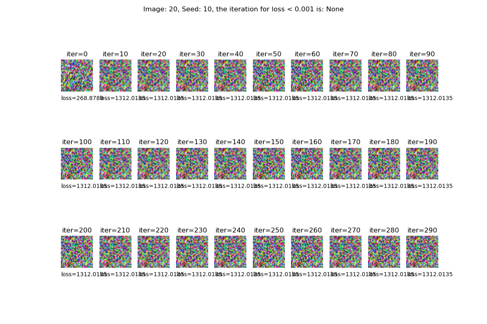

# Deep Leakage From Gradients [[arXiv]](https://arxiv.org/abs/1906.08935) [[Webside]](https://dlg.mit.edu) 


 


# Prerequisites

To run the code, following libraies are required

* Python >= 3.6
* PyTorch >= 1.0
* torchvision >= 0.4

# Code
 
```
# Single image on CIFAR
python main.py --index 25

# Single image on CIFAR, change the network to resnet56
python main.py --index 25 --nets resnet56


# Effect on different seeds
sh scripts/run_seeds.sh

# Effect on different nets
sh scripts/run_nets.sh
```

## Results on different seeds

<p align="center">
    
</p>

 


# License

Thank MIT-HAN-LAB for their [code base](https://github.com/mit-han-lab/dlg).
```
@inproceedings{zhu19deep,
  title={Deep Leakage from Gradients},
  author={Zhu, Ligeng and Liu, Zhijian and Han, Song},
  booktitle={Advances in Neural Information Processing Systems},
  year={2019}
}
```
